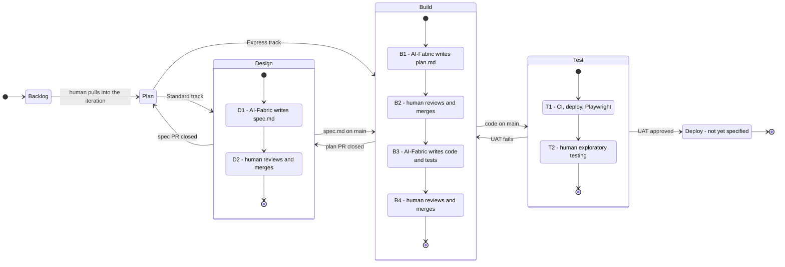

# AI-SDLC

This repository is a playbook for AI-native SDLC that uses GitHub issues, projects, actions, and PRs to automate the development process. It is based on Anthropic's [AI-Native SDLC playbook](https://claude.com/blog/the-ai-native-sdlc-playbook).

AI should automate as much as possible. Humans are in the loop to orchestrate, oversee, and have the final word by approving the work.

## Glossary

- **AI-Fabric**: The agentic tools, scripts, pipelines, etc that run the AI automation.
- **SDLC**: Software Development LifeCycle.
- **Play**: One numbered step of the process, described as Input / Execute / Guardrails / Output.
- **Track**: Express or Standard — how many review gates an issue must pass.
- **Artifact**: A version-controlled file (`spec.md`, `plan.md`, code, tests) that one stage commits and the next stage reads.

## Principles

- **The artifact chain is the audit trail.** Intent, spec, plan, diff and review findings, each
  committed and approved before the next stage starts.
- **Every guardrail is a GitHub Action.** Nothing depends on what an individual runs on their
  laptop. See [Why every guardrail is a GitHub Action](#why-every-guardrail-is-a-github-action).
- **The AI-Fabric never approves or merges its own work.**

## High-level Process

The playbook is built from plays grouped into six non-linear stages — Plan, Design, Build, Test,
Deploy, Maintain.

> **Scope note:** stages 0 through 4 (Backlog, Plan, Design, Build, Test) are specified below.
> **Deploy and Maintain are named but not yet written.**

An issue travels the pipeline in one of two **tracks**, decided in P1:

- **Standard** — the full chain. Three artifacts, three human review gates: spec, plan, then code.
- **Express** — typo, copy change or small bug. Spec and plan stay in the issue body, and the issue
  goes straight to code generation and a single PR.



### The board

Each repo has a GitHub Project, and one of its views is a Kanban board showing the progress of the
current iteration by status. An issue sitting in a column means:

- **Backlog**: Captured, not yet committed to an iteration. No AI involvement yet.
- **Plan**: Being shaped into a proto-spec with a human. Waiting on human authorization to proceed.
- **Design**: Its spec is being written or is in review.
- **Build**: Its plan or its code is being written or is in review.
- **Test**: Its code is merged and moving through CI, deployment and testing.
- **UAT**: Deployed and awaiting human exploratory testing.
- **Deploy**: Approved for release. *(Not yet specified.)*

There is deliberately **no Blocked column** — an issue that stops keeps its column and is flagged
with `ai-fabric:blocked`. Filter the board on that label to see everything waiting on a human. See
[Labels and Project status](#labels-and-project-status).

### Github issue types

Only Github built-in types.

- **Feature**: Describes an intent, idea or the problem to solve.
- **Bug**: Describes an error that must be fixed.
- **Task**: Work item for a human to handle. Example: create a new UI design using Claude Design.

## The Plays

### 0 - Backlog

#### BG1. Human creates issues in GitHub

Input
- A human creates a new issue with a title and a minimal description of the idea for future implementation.
- No AI involved.
- Issue:
  - Type: Feature | Bug
  - Labels: enhancement | bug
  - Project status: Backlog

Execute
- A human manually moves issues from the backlog to plan (`Status:Plan`) to start working on a new set of issues.
- Backlog planning and prioritization happens during this stage.

Guardrails
- None. Nothing is authorized before P1.

Output
- List of issues without details

### 1 - Plan

#### P1. Capture the intent of issues

Input
- An issue from the backlog
- New issue
- Issue:
  - Type: Feature | Bug
  - Labels: enhancement | bug
  - Project status: Plan

Execute
- A human describes the problem to solve, in their own words.
- Brainstorm with `@claude`, which writes the changes to the issue with a specific proto-spec template.
- One issue may result in multiple sub-issues if needed. Claude creates the new sub-issues when asked.
- **Track classification.** The AI-Fabric proposes a track (see
  [High-level Process](#high-level-process)):
  - Express requires *all* of: no schema change, no new dependency, no change to an authentication,
    authorization or other security surface, no public API change, no UI design work, and a single
    component affected. Anything else is Standard.
  - The classification is a recommendation. A maintainer can always force an issue up to Standard;
    only a maintainer can move one down to Express.
- When the issue is approved, a maintainer applies `ai-fabric:go` to hand it to the AI-Fabric.

Guardrails
- AI-Fabric issue classification (as above) — runs as an Action, and its output is visible in the
  issue for the maintainer to override before authorizing.
- **`ai-fabric:go` is the trust boundary of the whole pipeline.** Nothing the AI-Fabric does happens
  before this label is applied. The workflow verifies the actor who applied it has write permission
  and exits silently otherwise, so issue text from a non-collaborator can never start an agent run.
  See [Identity, permissions and the trust boundary](#identity-permissions-and-the-trust-boundary).

Output
- Issue as a proto-spec
- Track assigned (Express | Standard)

Why the two tracks exist: the Standard track costs three human review cycles before a line of code
ships. That is correct for substantial work and absurd for a typo, and the predictable failure mode
of applying it uniformly is that spec and plan approvals get rubber-stamped — which silently voids
every gate downstream.

### 2 - Design

#### D1. Create the spec

Input
- An issue labelled `ai-fabric:go` on the Standard track

Execute
- AI-Fabric GitHub Action
  - Issue:
    - Labels: + ai-fabric:spec
    - Project status: Design
  - Create a new branch from `main`
  - Write a new `/specs/<issue-number>/spec.md` based on the issue, applying the organizational
    [skills](#skills) — security, compliance, brand, UX, accessibility
  - Set the spec front-matter (`issue`, `supersedes`, `status: active`), and if it supersedes an
    existing spec, flip that spec's `status` to `superseded` in the same PR — see
    [Spec and plan lifecycle](#spec-and-plan-lifecycle)
  - Link the spec and the issue
  - When the spec requires a UI, create a Task sub-issue (`Status:Design`) for a human, apply
    `ai-fabric:blocked-on-design` to the parent, and stop the chain until the Task closes
  - Create a new PR -> automatically included in the AI-Fabric project
  - Link the PR to the issue
  - Issue:
    - Labels: - ai-fabric:spec, + ai-fabric:awaiting-approval

Guardrails
- Validate `spec.md` against the required template at generation time, not only at review.
- Validate the spec states testable acceptance criteria. B3 generates one Playwright test per
  criterion, so a criterion that cannot be asserted is a defect here.
- Attempt budget and escalation per [Failure handling](#failure-handling-and-escalation).

Output
- PR containing `spec.md`

#### D2. Spec review and approval

Input
- PR containing `spec.md`

Execute
- A human reviews the spec against the intent (issue)
- Brainstorm with `@claude` on the PR or human manually edits `spec.md`
- A human can ask another one to review
- A human makes the final call to accept the PR and merge it

Guardrails
- AI-Fabric GitHub Action
  - Review the spec against the intent (issue)
  - Validate a human edit kept the required `spec.md` template
  - Validate front-matter and supersession pointers are consistent
- GitHub — [standard PR gates](#standard-pr-gates)

Note: the AI reviewing this PR is the same model family that wrote the spec. It reliably catches
mechanical divergence from the template and from the stated intent; it does not catch judgment
errors, and it is not an independent reviewer. That is precisely why the human gate stays.

Output
- PR approved
- `spec.md` approved and merged

### 3 - Build

#### B1. Create the implementation plan

Input
- Issue
- Merge of a PR labelled `ai-fabric:spec`

Execute
- AI-Fabric GitHub Action
  - Issue:
    - Labels: - ai-fabric:awaiting-approval, + ai-fabric:plan
    - Project status: Build
  - Create a new branch from `main`
  - Write a new `/specs/<issue-number>/plan.md` based on the issue and `spec.md`
  - Write the full content of `spec.md` into the **PR description**, inside a collapsed `<details>`
    block, together with a permalink pinned to the merged commit SHA
  - Link the plan and the issue
  - Create a new PR -> automatically included in the AI-Fabric project
  - Link the PR to the issue
  - Issue:
    - Labels: - ai-fabric:plan, + ai-fabric:awaiting-approval

Guardrails
- Validate `plan.md` against the required template at generation time.
- Validate every acceptance criterion in `spec.md` is addressed by at least one step of the plan.
- Attempt budget and escalation per [Failure handling](#failure-handling-and-escalation).

Output
- PR containing `plan.md`, with `spec.md` reproduced in the PR description

Why the spec is in the description and not in the diff: the reviewer needs both documents on one
screen, but touching `spec.md` purely to force it into the diff would make git history show an edit
that never happened, and would conflict with the freeze rule in
[Spec and plan lifecycle](#spec-and-plan-lifecycle). The exception still applies — if plan review
reveals the spec itself is wrong, a spec edit belongs in this PR as an intentional, reviewed change.

#### B2. Plan review and approval

Input
- PR containing `plan.md`, with `spec.md` in the description

Execute
- A human reviews the plan against the spec
- Brainstorm with `@claude` on the PR or human manually edits `plan.md`
- If review shows the spec is wrong, correct `spec.md` in this PR — it is not yet frozen, because no
  code exists for it
- A human can ask another one to review
- A human makes the final call to accept the PR and merge it

Guardrails
- AI-Fabric GitHub Action
  - Review the plan against the spec
  - Validate a human edit kept the required `plan.md` template
  - Validate that it knows the build, lint, and test commands for the next step — in practice, that
    [`CLAUDE.md`](#claudemd) is present and current
- GitHub — [standard PR gates](#standard-pr-gates)

The same caveat as D2 applies: AI review here catches mechanical divergence, not judgment errors.

Output
- PR approved
- `plan.md` approved and merged

#### B3. Code generation

Input
- Issue
- `spec.md`
- Merge of a PR labelled `ai-fabric:plan` (Standard track), or `ai-fabric:go` on an Express issue

Execute
- AI-Fabric GitHub Action
  - Issue:
    - Labels: - ai-fabric:awaiting-approval (Standard) | - ai-fabric:go (Express), + ai-fabric:build
    - Project status: Build
  - Create a new branch from `main`
  - Generate code using agents and skills, guided by [`CLAUDE.md`](#claudemd) and the organizational
    [skills](#skills)
  - Run lint, auto-fix
  - Run security validations and auto-fix
  - Build the code and auto-fix
  - Generate unit tests
  - Run unit tests and auto-fix
  - **Generate Playwright tests** — one test per acceptance criterion in `spec.md`, selecting on the
    `data-testid` convention from `CLAUDE.md`
  - Create a new PR -> automatically included in the AI-Fabric project
  - Link the PR to the issue
  - Issue:
    - Labels: - ai-fabric:build, + ai-fabric:awaiting-approval

Guardrails
- Build, security validations and unit tests pass
- Playwright tests parse and compile, and every `data-testid` they reference exists in the diff —
  a static check, no environment required
- Every auto-fix loop is bounded — 3 attempts per gate, then escalate per
  [Failure handling](#failure-handling-and-escalation).

Output
- PR containing code changes, unit tests, and Playwright tests

**Why Playwright is generated here.** Split the test by which artifact is authoritative for which
part of it: `spec.md` is authoritative for **what to assert** (one test per acceptance criterion),
and the code is authoritative for **how to reach it** (routes, selectors, waits). B3 is the only
place both are available at once — the agent that just wrote the code has the diff in context and
knows the route and the `data-testid` it just created. Generating from the spec alone would guess at
selectors; generating later from a running app would encode whatever the app currently does, bugs
included, producing a test that can never fail.

**Sequencing caveat:** these tests first *execute* in T1, against the deployed app. B4 therefore
reviews Playwright tests that have never run, and B3's "tests pass" guardrail covers unit tests
only. A broken selector reaches `main` and is only discovered after merge.

Running them before merge is a candidate for a later revision, and it is not as cheap as it sounds:

- **Run it in the pipeline runner, not a cloud preview environment.** Docker Compose or Actions
  `services:` gives a real Postgres with migrations and seed data, torn down with the job, at the
  cost of runner minutes. Per-PR cloud environments cost real money, leak unless a TTL reaper
  deletes them, and are not worth it for this.
- **It cannot cover third-party dependencies.** Payment gateways, SSO and external APIs cannot be
  spun up in a runner. Stubbing them means the in-runner suite tests strictly less than T1 does.
- **Seed data becomes an artifact that rots.** Realistic fixtures need their own maintenance, and
  stale ones produce failures that have nothing to do with the change under review.
- **Environment failure must not block the PR.** "The environment did not start" is an infra signal,
  not a code signal — it reports as a neutral check with a note on the PR, and the tests still run
  for real in T1. Only "the environment started and a test failed" blocks the merge. Without that
  distinction, infra flake trains reviewers to bypass the gate.
- **It does not make T1 redundant.** Nothing in a runner exercises the real deployment — IaC,
  config, secrets, ingress — which is exactly what T1's deploy stage validates. An in-runner run is
  a smoke check on the *tests*, never on the deployment.

#### B4. Code review

Input
- PR containing code changes, unit tests, and Playwright tests

Execute
- A human reviews the PR — the behaviour and the tests that prove it, together
- Ask `@claude` to make changes, fixes, improve unit-test coverage
- A human can ask another one to review
- A human makes the final call to accept the PR and merge it

Guardrails
- PR build action
  - Build code
  - Run linter to validate warnings
  - Run unit tests and collect code coverage
- GitHub — [standard PR gates](#standard-pr-gates), plus:
  - PR minimum code coverage validation
  - CodeQL scan
  - SAST scan
  - Dependency scan
- AI-Fabric GitHub Action (adds `ai-fabric:code-review` at the start of its run, removes it at the end)
  - Validate that the code covers the plan and spec
  - Validate there is one Playwright test per acceptance criterion
  - Code review

Output
- Code changes
- Unit tests
- Playwright tests

### 4 - Test

#### T1. CI pipeline

Input:
- Code, unit tests and Playwright tests on `main`
- CI trigger

Execute:
- CI pipeline action
  - Stage build
    - Issue:
      - Labels: - ai-fabric:awaiting-approval, + ai-fabric:ci
    - Build code
    - Run linter to validate warnings
    - Run unit tests and collect code coverage
    - Create package (docker image or build artifact)
  - Stage deploy
    - Use concurrency group to sequence tests
    - Issue:
      - Labels: - ai-fabric:ci, + ai-fabric:test
      - Project status: Test
    - Deploy frontend and backend
  - Stage test
    - Run playwright smoke tests
    - Save test results as pipeline artifacts
    - AI-Fabric
      - Triage failures (see the assertion rule below)
      - Validate test results and create new bugs for failed tests as sub-issues
      - Validate tests cover all `spec.md` acceptance criteria, create new bugs as sub-issues if needed
    - Issue:
      - Labels: - ai-fabric:test, + ai-fabric:tests-passed | ai-fabric:tests-failed
    - Fail the stage when tests fail
  - Stage UAT
    - Wait on environment approval
    - Deploy frontend and backend
    - Issue:
      - Labels: + ai-fabric:uat
      - Project status: UAT

Guardrails:
- Tests pass
- Tests cover acceptance criteria
- **The assertion rule.** A Playwright failure is either a bad locator or timing assumption, or a
  genuine defect. The AI-Fabric may repair locators, waits and fixtures. It may **not** weaken,
  relax, skip or delete an assertion that traces to an acceptance criterion — that requires a human
  and a spec change. Without this rule the agent resolves real bugs by loosening assertions, and the
  suite silently stops testing anything.

Output:
- App running in UAT
- Build artifact
- Test results

#### T2. Manual tests

Input:
- App running in UAT
- Issue

Execute:
- A human manually/exploratory tests the app running in UAT against `spec.md` acceptance criteria
- A human creates new Bug issues as sub-issues for any failures found
- **Anything found here that the Playwright suite missed is by definition a coverage gap** — the Bug
  sub-issue carries a "add the regression test" requirement, so the suite grows from real escapes
- A human approves the issue when manual tests pass

Guardrails:
- None. This play is the human judgment the automated gates cannot replace.

Output:
- Issue approved for deploy, labelled `ai-fabric:uat-approved`

The issue is **not** closed here. It closes at release, in the not-yet-specified Deploy stage.

#### T3. Nightly regression pipeline

Input:
- Scheduled nightly trigger (cron)
- All existing playwright tests

Execute:
- CI pipeline action
  - Run all existing playwright tests against the latest deployed environment
  - Save test results as pipeline artifacts
  - AI-Fabric
    - Validate test results and create new Bug issues as sub-issues for failed tests
  - Fail the stage when tests fail

Guardrails:
- The assertion rule from T1 applies here too: locator repairs are allowed, assertion changes are not.

Output:
- Test results
- New Bug issues for failures found

### 5 - Deploy

Not yet specified.

### 6 - Maintain

Not yet specified.

---

## Reference

Everything below is detail the plays refer to.

### Standard PR gates

Enforced by GitHub on every AI-Fabric PR:

- All comments must be resolved
- Branch protection rules
- Minimum approvals
- CODEOWNERS approval
- Author cannot approve

### Labels and Project status

Three layers track an issue, and they answer different questions.

**`ai-fabric:<stage>` — progress indicator. "An agent is working on this right now."**
Added at the start of an Action run and removed at the end of the *same* run. Long-running steps
like code generation are exactly why this exists: it tells a human which step an issue is currently
in. A cleanup step with `if: always()` removes it, so a crashed or cancelled run never orphans one.

**`ai-fabric:awaiting-approval` — queue state. "This is waiting on a human."**
Persists across runs until the human acts.

**`ai-fabric:blocked` — exception flag. "This stopped and needs a human."**
Also persists until cleared. It is **orthogonal to Project status, and never changes it.** An issue
that escalates out of B3 keeps status `Build`, because the whole point of the flag is to show *where*
the work stopped. A `Blocked` column would erase exactly the information the flag exists to carry,
and would make "how long did this sit in Build" unanswerable.

**Project status — the coarse stage.** What Kanban column the issue sits in. It only ever moves when
the work genuinely moves to a different stage — forwards on success, backwards on a rejection.

| Play | Project status | Progress label (during the run) | Persistent label (after the run) |
| --- | --- | --- | --- |
| BG1 | Backlog | — | — |
| P1 | Plan | `ai-fabric:classify` | `ai-fabric:go` (applied by a maintainer) |
| D1 | Design | `ai-fabric:spec` | `ai-fabric:awaiting-approval` |
| D2 | Design | — | cleared on merge |
| B1 | Build | `ai-fabric:plan` | `ai-fabric:awaiting-approval` |
| B2 | Build | — | cleared on merge |
| B3 | Build | `ai-fabric:build` | `ai-fabric:awaiting-approval` |
| B4 | Build | `ai-fabric:code-review` | cleared on merge |
| T1 | Test, then UAT | `ai-fabric:ci`, `ai-fabric:test` | `ai-fabric:tests-passed` \| `ai-fabric:tests-failed`, `ai-fabric:uat` |
| T2 | UAT | — | `ai-fabric:uat-approved` |
| T3 | — | — | — |

### Spec and plan lifecycle

Specs and plans live at `/specs/<issue-number>/spec.md` and `/specs/<issue-number>/plan.md`. They
are **permanent**.

Each spec carries front-matter:

```yaml
issue: 456
supersedes: [123]
status: active   # active | superseded
```

**A spec is amendable until B3 has produced code against it, and frozen afterwards.** If plan
review (B2) exposes a defect in the spec, it is corrected in place — which is the reason plan review
happens before code generation.

**Changing a frozen spec means writing a new one.** A later change to the same feature gets its own
`/specs/<new-issue-number>/` directory listing the issues it `supersedes`. The single permitted
mutation to a frozen spec is its pointer — flipping `status` to `superseded` and recording
`superseded-by` — performed by D1 in the same PR.

That exception earns its keep, because of this rule: **only `status: active` specs are loaded as
agent context.** Without supersession, a feature touched thirty times over a year would present the
fabric with thirty overlapping, partly-contradictory specs. `/specs/README.md` is a generated index
of active specs.

`/specs/` is therefore a historical ledger answering *why something changed*. It deliberately does
not answer *what the product does today* — that belongs in product documentation refreshed at
release time, which is part of the not-yet-specified Deploy stage.

**The issue that originated a superseded spec stays closed.** Reopening a shipped issue destroys the
record of when it shipped and corrupts the project's cycle-time and throughput data. The new issue
links back (`Relates to #123`) and the new spec's `supersedes:` carries the relationship. Reopen in
exactly one case: the work was never actually delivered — closed in error, or a regression caught
before release. A defect found after release is always a new Bug issue.

### Triggers and idempotency

Plays are triggered by **the merge of a PR carrying a specific label**, never by a path filter on a
file. A path filter would let a human editing a spec, or an unrelated merge from `main`, retrigger a
generation play.

Every AI-Fabric workflow starts by reading the issue's current label and status, and exits without
acting if the issue is not in the state that play consumes.

**A run authenticated with the default `GITHUB_TOKEN` does not trigger further workflows.** The
whole pipeline depends on one play's merge starting the next, so it would silently stall after the
first hop. Running as the GitHub App is what makes the chain work — that decision is load-bearing
for the process, not only for audit and licensing.

### Workflow layout

The AI-Fabric is **centralized in an org-level repo** and consumed by every app repo. Setting up a
new repo means copying three small files.

`<org>/ai-fabric` holds all the real logic — one reusable workflow per play (`on: workflow_call`)
plus the shared `fabric-setup` composite action. Nothing in it is repo-specific.

Each app repo carries **three thin caller workflows**, identical across repos. They are grouped by
trigger rather than by play, because a workflow's `on:` block must be declared in the repo where the
event happens — that is the only reason a local file has to exist at all:

| Caller workflow | Trigger | Fans out to |
| --- | --- | --- |
| `fabric-issues.yml` | `issues` (opened, edited, labeled, closed) | P1 classify, D1 spec, unblock |
| `fabric-pr.yml` | `pull_request` (opened, synchronize, closed) | D2/B2/B4 reviews, B1 plan, B3 code, evals |
| `fabric-pipeline.yml` | `push` to `main`, `schedule` | T1 CI, T3 nightly regression |

Each is roughly ten lines: a guard and a
`uses: <org>/ai-fabric/.github/workflows/<play>.yml@v1`.

**This is not the monolith rejected below**, because the caller fans out to **one job per play**,
and `permissions:`, `concurrency:` and check names are all job-level. Least privilege survives, each
play keeps a distinct required check (rendered as `fabric-pr / B3 · generate code`), and a play whose
guard does not match shows as skipped rather than as a pass. The only cost is that one event starts
one run containing several skipped jobs.

**Do not centralize `ci.yml` and `pr-build.yml`.** Build, package and deploy commands are genuinely
repo-specific. They stay local, and may call a shared reusable workflow for the common shape with
repo-level inputs.

Versioning is the main benefit: app repos pin `@v1` as a moving major tag, so a fix to the spec
prompt reaches every repo without touching one of them, and a new major can be canaried on a single
repo first. Pin by commit SHA instead where supply-chain strictness outweighs that convenience.

#### Why not one workflow guarded by `if`

Collapsing the plays into a single workflow was considered and rejected. The same reasoning is what
makes the per-play *job* split above load-bearing:

- **`permissions:` is scoped per job, never per step.** A monolithic job must grant the union of
  every play's scopes, so a review run would carry the same write scopes as code generation. `if`
  guards control execution, not the token, so this is not fixable with conditionals. It contradicts
  [Identity, permissions and the trust boundary](#identity-permissions-and-the-trust-boundary).
- **Branch protection keys off check names.** One job for everything emits one check name, so a spec
  PR could not require the spec-template validation specifically.
- **Concurrency.** T1 needs a concurrency group to sequence deployments; shared with everything else
  it would serialize spec generation for unrelated issues.
- **Blast radius.** A change to one play would risk every play.

#### The shared composite action

The cost of splitting is drift — several workflows, one of which quietly loses the trust check. So
the repeated mechanics live in `fabric-setup`, used by every play:

1. Mint a short-lived GitHub App installation token.
2. Verify the actor who applied the triggering label has write permission; exit silently otherwise.
3. Read the issue's current labels and Project status, and apply the idempotency guard above.
4. Apply the `ai-fabric:<stage>` progress label, with `if: always()` cleanup so a crashed run leaves
   nothing orphaned.

A `workflow_call` reusable workflow for "run the agent with this prompt, then open a PR" removes the
rest. The security-critical logic then exists once, and
[the eval suite](#evals-for-the-ai-fabric) has a single unit to gate.

### Failure handling and escalation

Every generation play is bounded.

- **Attempt budget:** each auto-fix gate in B3 (lint, security, build, unit tests) gets at most
  3 attempts. The job also carries a wall-clock cap and a token budget.
- **On exhaustion:** remove the progress label, add `ai-fabric:blocked`, assign the maintainer who
  applied `ai-fabric:go`, and comment with the failing gate, the last failing output, and a link to
  the run. **Project status does not change.**
- **The agent never widens its own budget** and never disables a failing check to make a gate pass.

Rejection paths — these *do* move Project status, because the work genuinely returns to an earlier
stage:

- **Spec PR closed unmerged** — status returns to `Plan`, all `ai-fabric:*` labels removed except
  `ai-fabric:go`, which is also removed so re-entry requires a fresh human authorization.
- **Plan PR closed unmerged** — status returns to `Design`. The merged spec stays on `main`; B1 can
  be re-triggered by re-applying `ai-fabric:spec` to a new plan PR.
- **Code PR closed unmerged** — status returns to `Build`, awaiting a new B3 run.
- **UAT fails (T2)** — status returns to `Build`, `ai-fabric:uat` removed, and the Bug sub-issues
  raised by the human become the input to a new B3 run on the parent.

Blocked on human work:

- When D1 creates a UI design Task, it is created as a **sub-issue** of the parent, and the parent
  gets `ai-fabric:blocked-on-design`. The parent keeps status `Design`, where the work actually is.
  B1 does not trigger while that label is present. Closing the Task fires a workflow that clears the
  label and resumes the chain. This is a real dependency, not just a linked issue.

### `CLAUDE.md`

A single version-controlled file holding what every agent session needs to know:

- Build, lint, test and run commands (B2 validates these are present and current).
- Architecture, directory layout, and the conventions the code must follow.
- Recurring mistakes the agent should not repeat.
- **The selector convention** — components expose `data-testid`, and Playwright tests select on it
  only. B3 depends on this to generate stable tests; without it the nightly suite becomes noise.

### Skills

Organizational policy encoded as versioned skills in `.claude/skills/`: security standards, API
conventions, brand rules, UX and accessibility constraints, compliance requirements. Applied by D1
when writing a spec and by B3 when writing code, so constraints are enforced at design time instead
of being discovered at code review.

### Identity, permissions and the trust boundary

Issue bodies and PR comments are untrusted input. Anyone who can file an issue can write text that
an agent with repository write access will read, which makes prompt injection a real attack surface
rather than a theoretical one. The `ai-fabric:go` gate in
[P1](#p1-capture-the-intent-of-issues) is what contains it.

**Runtime identity is a GitHub App** (`app/ai-fabric`): fine-grained repository permissions,
short-lived installation tokens, and an actor entry in the enterprise audit log, with no licence
seat and no SSO enrolment — all of which a plain bot user on GitHub Enterprise would cost or lack.
The agent runs non-interactively, cannot merge, and cannot approve its own PRs.

A GitHub App cannot be an issue assignee, which is why authorization is carried by a label rather
than by assignment. The label event records who authorized the work and when, so the audit trail is
equivalent.

### Evals for the AI-Fabric

The AI-Fabric is software, and today it is the only software in this process with no SDLC of its
own. A regression suite runs as a GitHub Action whenever the fabric's own configuration changes —
prompts, skills, `CLAUDE.md`, workflow definitions — using real historical issues as test cases, and
gates the change.

Without this, a prompt edit that quietly degrades spec quality is invisible until it reaches a human
reviewer, several plays downstream.

### Why every guardrail is a GitHub Action

The agent harness's local hook mechanism is deliberately *not* used. Hooks are *preventive* — they
block an agent action mid-flight — while Actions are *detective*, catching a violation after the
agent has already acted.
That is acceptable here for one specific reason: the agent only ever runs inside an Action, never on
a developer machine, and it has no ability to merge. Branch protection plus required status checks
are the actual enforcement point, so a check that runs after the agent acts but before anything
reaches `main` is sufficient.

`CLAUDE.md` and skills are still used — they are context and policy, not hooks, and they work
unchanged in a non-interactive Action runner.

---

TODO - Changelog/release notes
TODO - update documentation and manuals
TODO - generate short videos explaining features
